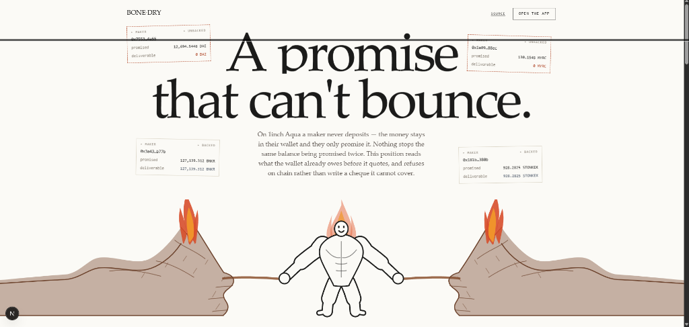
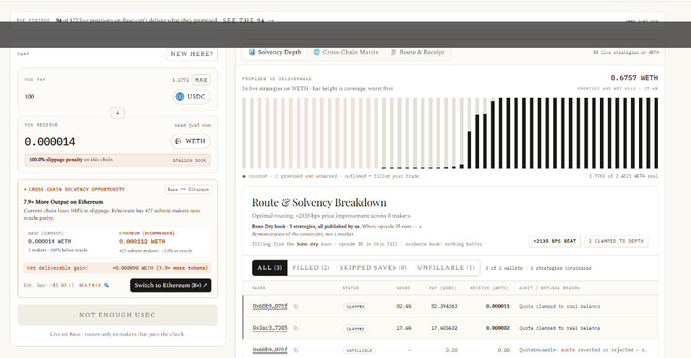
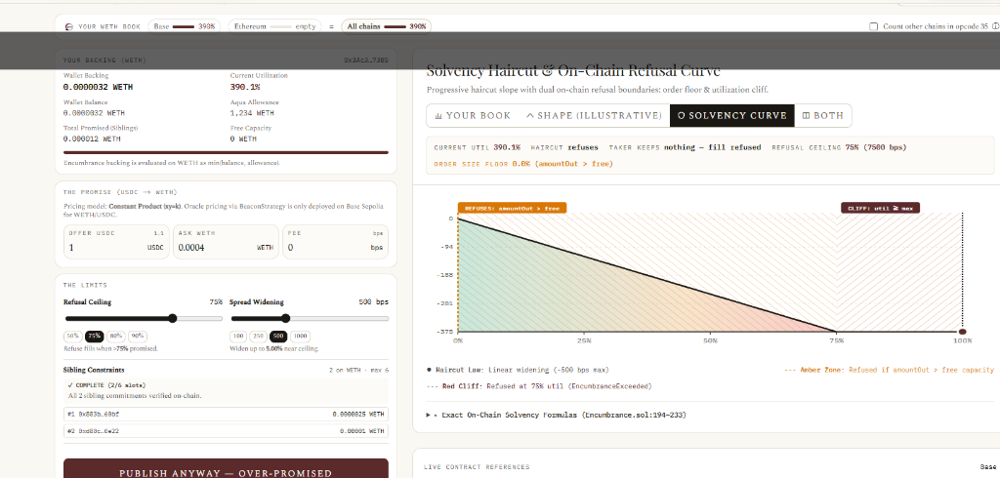
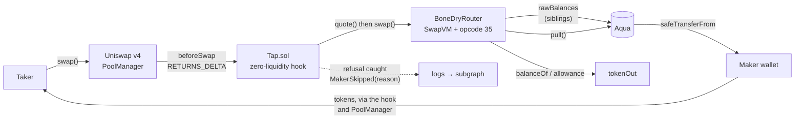
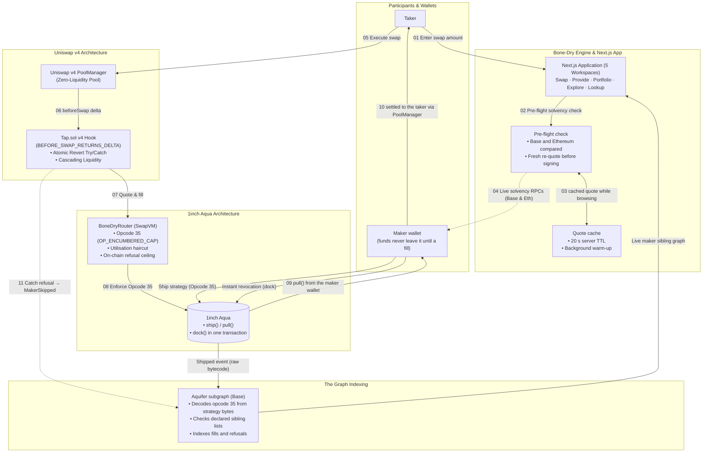

<div align="center">


# Bone Dry

**A promise that can't bounce.**

An Aqua position that prices itself off its own wallet's existing obligations —
and refuses, on-chain, before it can write a cheque that bounces.

[](https://github.com/1inch/aqua)
[](https://github.com/1inch/swap-vm/tree/release/1.0.2)
[](https://github.com/Uniswap/v4-core)
[](https://api.studio.thegraph.com/query/1758723/aquifer/v0.0.4)
[](#security-and-testing)
[](https://bone-dry.vercel.app/)

Built for ETHOnline 2026 — 1inch (Build an Aqua App), Uniswap Foundation, The Graph.

**[Live demo](https://bone-dry.vercel.app/)** · deployed on Base and Ethereum mainnet

<br/><br/>



</div>

---

On [1inch Aqua](https://github.com/1inch/aqua), a market maker never deposits
anything. The money stays in their own wallet — they just **promise** it. That is
genuinely new, and it is the entire reason Aqua is interesting.

It also means nothing stops a maker promising the same money twice. Or 257 times.

## Table of contents

- [The problem, in one paragraph](#the-problem-in-one-paragraph)
- [We measured it](#we-measured-it)
- [Platform walkthrough](#platform-walkthrough)
  - [Taker desk: Pre-flight solvency depth & dual-chain routing](#taker-desk-pre-flight-solvency-depth--dual-chain-routing)
  - [Maker desk: Solvency haircut & on-chain refusal curve](#maker-desk-solvency-haircut--on-chain-refusal-curve)
- [How it works](#how-it-works)
  - [One fill, end to end](#one-fill-end-to-end)
  - [What a fill costs](#what-a-fill-costs)
- [Cross-chain solvency](#cross-chain-solvency)
  - [Same trade, both chains](#same-trade-both-chains)
  - [The pre-flight check](#the-pre-flight-check)
  - [Your book on every chain](#your-book-on-every-chain)
  - [Fast quotes](#fast-quotes)
  - [The swap workspace](#the-swap-workspace)
- [Architecture](#architecture)
- [The instruction](#the-instruction)
  - [The curve](#the-curve)
  - [Why the sibling list comes from the maker](#why-the-sibling-list-comes-from-the-maker)
- [Three tracks](#three-tracks)
  - [1inch — Build an Aqua App](#1inch--build-an-aqua-app)
  - [Uniswap Foundation](#uniswap-foundation)
  - [The Graph](#the-graph)
- [What is live, and what is not](#what-is-live-and-what-is-not)
- [Tech stack](#tech-stack)
- [Repository structure](#repository-structure)
- [Getting started](#getting-started)
- [Deployed addresses](#deployed-addresses)
- [Security and testing](#security-and-testing)
- [Design notes and roadmap](#design-notes-and-roadmap)

---

## The problem, in one paragraph

`Aqua.ship()` writes a number into a mapping. No transfer, no lock, no check:

```solidity
function ship(address app, bytes calldata strategy, address[] calldata tokens, uint256[] calldata amounts)
    external returns (bytes32 strategyHash)
{
    strategyHash = keccak256(strategy);
    emit Shipped(msg.sender, app, strategyHash, strategy);
    for (uint256 i = 0; i < tokens.length; i++) {
        Balance storage balance = _balances[msg.sender][app][strategyHash][tokens[i]];
        require(balance.tokensCount == 0, StrategiesMustBeImmutable(app, strategyHash));
        balance.store(amounts[i].toUint248(), tokensCount);   // ← a number. that is all.
    }
}
```

A maker with 100 USDC can ship five strategies each promising 100 USDC, and every
one of them is individually valid — each is ≤ 100. They share one balance, so only
the first taker to arrive gets paid. Everyone else's transaction reverts on the
last line, when `safeTransferFrom` finds an empty wallet.

It is writing cheques with nothing checking the balance.

**Everyone else in this field built a better price. We built a promise that can't
bounce.**

## We measured it

Ethereum mainnet, our own index:

| Token | Advertised | Actually deliverable | Phantom |
|---|---:|---:|---:|
| WETH | 102,593 | **4** | 100% |
| USDC | 5,253,030 | 131,572 | 97.5% |
| USDT | 733,111 | 290,988 | 60.3% |
| DAI | 288,313 | 228,976 | 20.6% |

860 maker/token pairs are backed by more than one strategy. **600 of them promise
more than the wallet holds. 419 have zero backing at all.** The largest single
wallet carries **257 strategies on one token**.

Per maker: `committed = Σ virtual across their live strategies`,
`backing = min(wallet balance, allowance)`, `deliverable = min(committed, backing)`.

> **Read this before quoting the numbers.** Some advertised figures are absurd on
> purpose — one strategy promises 1.4 billion WBTC, which exceeds every bitcoin
> that will ever exist. Those are junk commitments, and Aqua accepts them without
> complaint. That is evidence *for* the argument, not a flaw in the measurement,
> but do not read it as real depth. DAI at 20.6% matters too: a metric reading
> 100% everywhere would mean the measurement was broken, not the market.

## Platform walkthrough

Bone Dry turns solvency verification into a first-class user experience across both taker and maker workflows on Base and Ethereum mainnet.

### Taker desk: Pre-flight solvency depth & dual-chain routing

Before any signature touches a wallet, Bone Dry verifies on-chain solvency for every candidate maker, clamps quotes to verifiable backing (`min(balanceOf, allowance)`), and evaluates whether routing across Base or Ethereum yields superior deliverable output.

<p align="center">
  
  <br/>
  <em><b>Swap Workspace</b>: Live deliverable vs. phantom liquidity depth histogram, maker encumbrance clamping, and dual-chain execution routing.</em>
</p>

### Maker desk: Solvency haircut & on-chain refusal curve

Makers construct strategies whose SwapVM bytecode enforces Opcode 35 (`OP_ENCUMBERED_CAP`). The strategy dynamically widens its spread as sister commitments consume backing, and enforces a hard on-chain refusal cliff (`maxUtilBps`) before writing a cheque the wallet cannot cover.

<p align="center">
  
  <br/>
  <em><b>Provide / Maker Builder</b>: Interactive Solvency Response Curve illustrating linear widening haircuts, order size floor (<code>amountOut &gt; free</code>), refusal cliff (<code>util &ge; max</code>), and cross-chain sibling aggregation.</em>
</p>

## How it works

A maker ships a strategy whose program contains **opcode 35**. At fill time, before
any settlement, the instruction reads how much of that wallet is already promised
to the maker's *other* strategies, and prices accordingly:

- lightly encumbered → quote is unchanged
- heavily encumbered → quote **widens**
- past a line the maker chose → it **refuses**

Not a filter we run on your behalf. A property of the position itself, true for any
taker through any app, whether Bone Dry is involved or not.

### One fill, end to end



1. The taker swaps against a Uniswap v4 pool that holds **zero liquidity**.
2. `Tap.sol` takes the whole swap in `beforeSwap` via `BEFORE_SWAP_RETURNS_DELTA_FLAG`.
3. It quotes each candidate maker through `BoneDryRouter`.
4. Opcode 35 sums the maker's sibling commitments, reads real backing, and either
   adjusts the quote or reverts.
5. Survivors are filled by `Aqua.pull()` from the **maker's own wallet**, and the
   tokens reach the taker through the hook and the PoolManager in the same
   transaction — the pool never holds a balance.
6. A maker who refused is caught by the hook and logged with the revert selector.
   This matters: **a reverted transaction emits nothing**, so without the hook
   catching it, refusals would be invisible to any indexer.

> **On mainnet.** There are two Tap hooks on each chain, because `Tap.router` is
> `immutable` (`Tap.sol:42`): `0xeAdD3C76…` is bound to 1inch's canonical router
> (146 third-party strategies, opcode table ending at 34) and `0xaC7bCA41…` to
> `BoneDryRouter` (opcode 35). `Aqua.pull` keys balances on `msg.sender`, so the two
> books can never be filled in one transaction.
>
> The app plans both books, ranks them by the rate a taker actually gets, and builds
> the swap against the hook that can fill the winner. At small sizes the Bone Dry
> book wins and steps 3–4 run through opcode 35; at larger sizes its shallow reserves
> price out and the evidence book wins. First signed fill through opcode 35:
> [`0x95aab656…`](https://basescan.org/tx/0x95aab656e6e9459b37b399f62ffebccf6b06d5aa24041ab7f0c45de861fbafa2)
> — `EncumbranceApplied` read 23.0e12 of sibling commitments against 38.5e12 backing
> (5,971 bps) and cut the output from 410,598,350,587 to 398,339,936,831 wei, a
> 298.54 bps haircut against the 298.55 the curve specifies.
>
> Step 6 is live end to end: both Tap hooks are data sources in `aquifer/v0.0.4`, and the
> first on-chain refusal
> [`0xe29c843d…`](https://basescan.org/tx/0xe29c843d5f09e4a27eeea4d54e1926a72453bc75a51f1896c34648a3359794d0)
> (`EncumbranceExceeded` at 8,997 bps against an 8,000 ceiling) is indexed and shown in
> Portfolio. See [PLAN-GRAPH.md](PLAN-GRAPH.md).

### What a fill costs

Measured on a Base mainnet fork (`forge test --gas-report`):

| Operation | Gas |
|---|---:|
| End-to-end demo: two fills, one refusal | 1,037,462 |
| Single unencumbered fill (Case 1) | 422,579 |
| Fill with one sibling + haircut (Case 2) | 518,883 |
| `EncumbranceApplied` event | ~3,035 |
| Reading one sibling's `rawBalances` | ~2,600 cold |
| **`dock()` — a maker revoking everything** | **~36k per transaction** (4,452 in execution) |

That last row matters: a promise on Aqua can be withdrawn in one transaction, which is why Bone Dry prices it. See [Design notes](#design-notes-and-roadmap).

## Cross-chain solvency

Opcode 35 makes a strategy honest on the chain it lives on. But the same wallet address
can promise on Base **and** on Ethereum, and Aqua's two deployments share no state. Bone Dry
is deployed on both mainnets and reads both, so a maker and a taker see the whole picture.

### Same trade, both chains

Before a swap, the app quotes the trade on the other chain too and compares the two on the
terms that matter: **price per unit actually filled**, and **how much of the trade each chain
can take**. Live reading for 100 USDC → WETH:

| | Base | Ethereum |
|---|---|---|
| Output | 0.0000142 WETH | 0.0001124 WETH |
| Price vs Chainlink oracle | −99.96% | +0.3% to +2.0% |
| Share of the trade that fills | **100%** | **0.27%** (0.28 USDC) |
| Wallets filling | 2 | 2, of 477 strategies checked |

Base's Bone Dry book is small, so it fills the whole trade at a poor price; Ethereum's makers
price it well but can take only a fraction. Bone Dry shows both facts side by side — a
**2,863× better price for 0.27% of the size** — so the taker picks the size and the chain with
eyes open. At small sizes the other chain fills in full and the comparison is simply the
better price.

### The pre-flight check

Pressing **Swap** runs a short, visible check before the wallet opens:

1. **Read the Aqua book** — the strategies in the book this trade fills from.
2. **Check every maker against its wallet** — each claim capped at `min(balance, allowance)`,
   and whether opcode 35 is in the fill.
3. **Compare chains** — price per filled unit and fill share on the other chain.

If the other chain is materially better, the modal shows both routes and offers to switch;
otherwise it goes straight to signing. Just before signing, the route is **re-quoted with no
cache**, and the swap stops with a clear message if the best book changed or the quote moved
by more than 1% — so the maker list the hook receives is always current.

### Your book on every chain

Provide and Portfolio read one endpoint, [`/api/maker-book`](web/app/api/maker-book/route.ts),
that assembles a wallet's book on both chains — the Aquifer subgraph on Base, and the 1inch
index plus BoneDryRouter `Shipped` logs on Ethereum — with every claim re-read live and an
opcode-35 verdict for each strategy (current utilisation against its ceiling).

- **Provide** shows the book as a one-line strip per chain plus a histogram of promises stacked
  against backing, with the strategy being drafted as a dashed bar.
- **Count other chains in opcode 35** is an opt-in: the declared total becomes
  `max(this chain's promises, combined utilisation × this chain's backing)`, so the strategy
  refuses when either this chain or the whole book is over its ceiling. The contract enforces
  the floor on what it can see on this chain, and a maker may always declare more — so a
  cross-chain declaration is accepted as written.
- **Portfolio** lists every strategy on every chain with its opcode-35 verdict, and the fills
  and refusals the subgraph has recorded for it, each linked to its transaction.

### Fast quotes

Repeat quotes for the same pair and size are served from a 20-second in-memory cache on the
server (~36 ms, versus ~4.4 s for a cold multi-RPC read on Base) and a short-lived client cache,
with the counterpart chain's route warmed in the background. Signing always uses a fresh quote.

### The swap workspace

The Swap tab keeps everything on one screen: the trade on the left, and a tabbed workspace on
the right — **Book** (an interactive promised-vs-deliverable chart: filter, hover, pin),
**Cross-chain** (both routes with price, fill share and live gas), and **Receipt** (pool state
and the opcode-35 proof).

## Architecture



**The rule the app follows:** anything that decides whether a transaction will
succeed is read live from chain at quote time. Anything historical or aggregate
comes from an index. Mixing those up is how a UI says "solvent" and the
transaction then reverts.

## The instruction

`contracts/src/vm/Encumbrance.sol`, appended to the opcode table at index 35.

**We do not fork 1inch's swap-vm repo.** `AquaOpcodes._opcodes()` is declared
`internal pure virtual`, so `BoneDryOpcodes` subclasses and overrides it, appending
opcode 35 and leaving every upstream index 0–34 exactly where it was. Upstream
stays updatable, previously-encoded programs still run, and the track's
*"redeployments of a modified SwapVM contract is allowed"* is satisfied without a
fork. The router comes to **19,793 bytes**, inside EIP-170's 24,576 with no stock
instruction stripped.

```
encumbered = Σ rawBalances(maker, app, siblingHash_i, tokenOut)   // other promises
backing    = min(balanceOf(maker), allowance(maker, AQUA))        // what's really there
util       = encumbered / backing
free       = backing − encumbered
```

Argument encoding, packed into the program:

```
[0:2]                    uint16   siblingCount
[2 : 2+32n]              bytes32  siblingHashes[siblingCount]
[..+32]                  uint256  declaredTotalEncumbrance
[..+2]                   uint16   maxUtilBps      // refuse at or above this
[..+2]                   uint16   widenBps        // haircut at 100% utilisation
```

Docked siblings are skipped — Aqua marks them with `tokensCount == 0xff`, so a
docked strategy encumbers nothing and the quote widens back automatically.

### The curve

```
quote
  │────────────────╮
  │                 ╰──────╮
  │                         ╰────╮
  │                               ╰──╮
  │                                   ╳  ← refuses at maxUtilBps
  └──────────────────────────────────────── utilisation
  0%                                    100%
```

- **exactIn** → `amountOut` is haircut by `amountOut × widenBps × util / 1e8`
- **exactOut** → `amountIn` is raised by the same proportion, rounded up

Both paths then hit the same hard floor: `amountOut > free` reverts
`EncumbranceInsufficient`. The haircut is what makes this a position with a curve
rather than a binary guard; the floor is what sits underneath it.

### Why the sibling list comes from the maker

Aqua's balance mapping is not enumerable. There is no on-chain way to ask *"what
else has this maker shipped?"* — so the strategy carries the hashes in its program.

A dishonest maker can declare a short list and dodge the constraint. **This is not
a hole we missed; it is the seam the rest of the project exists to close.**

| Layer | Job |
|---|---|
| Opcode 35 | enforces the constraint on-chain, at fill time |
| Aquifer subgraph | the only thing that knows *every* live strategy — computes `siblingListComplete` and `missingSiblings` |
| `Tap.sol` | refuses to route to strategies whose list is short *(next)* |

On-chain enforcement and off-chain completeness are two different jobs, and neither
can do the other's.

## Three tracks

### 1inch — Build an Aqua App

The track asks for *"a custom Aqua app that implements a sophisticated DeFi
position"* and scores SwapVM usage higher.

**The position:** a maker's quote is a function of their own unencumbered balance.
Every other approach in this field prices off *external* state — an oracle,
realised volatility, a pool, an auction. This one looks inward, and as far as we
can find, nothing else on Aqua does.

**SwapVM usage is structural, not decorative.** Remove opcode 35 and there is no
encumbrance read, no curve, and no refusal — just a stock quote. The instruction
lives in the opcode table, not behind the `Extruction` escape hatch.

**Cross-Chain Solvency Navigation:** 1inch Aqua contracts live independently on Ethereum L1
and Base L2, with completely decoupled maker balance sheets. Bone Dry is the first application
to compare live deliverable backing across Aqua deployments, safeguarding takers from illiquid
local books and guiding makers to underserved liquidity pools.

Two mechanics we relied on, each proven separately in
[`FacilityProof.t.sol`](contracts/test/FacilityProof.t.sol):

- **`Aqua.pull()` settles to an arbitrary recipient.** Maker capital can move
  straight to a third party; the app never takes custody and needs no balance
  sheet (proven in [PROOFS.md](PROOFS.md) P1).
- **`dock()` is one transaction (~36k gas)** — instant, unilateral and unpenalised.

### Uniswap Foundation

`Tap.sol` is a v4 hook on a pool with **zero liquidity**, deployed on Base mainnet,
Ethereum mainnet and Base Sepolia. It takes the entire swap in `beforeSwap` using
`BEFORE_SWAP_RETURNS_DELTA_FLAG`, sources depth from maker wallets through Aqua,
and settles with the PoolManager without ever adding liquidity. TVL is zero before
and after — verifiable on chain.

Its second job is the one that is easy to miss: **it is the only place a refusal
can be recorded.** Opcode 35 refuses by reverting, and a reverted transaction emits
no logs. `Tap.sol` try/catches each maker and emits `MakerSkipped` with the revert
selector, which is what makes the refusal feed possible at all.

**Pre-flight check:** before the wallet opens, the app re-quotes the route fresh and compares it
with the same trade on the other chain, so the taker sees price, fill share and the book it fills
from before signing.

Hook address mining (a CREATE2 salt search until the address's low bits carry exactly the hook's permission flags) is in
[`contracts/script/Deploy.s.sol`](contracts/script/Deploy.s.sol).

### The Graph

**Aquifer** — [`subgraph/`](subgraph/), deployed and synced on Base.

The subgraph is not a display layer here; it computes something no contract can.
`handleShipped` decodes opcode 35's arguments straight out of the `Shipped` program
bytes — walking `[opcode][argsLength][args]` exactly as `runLoop` does — so
`maxUtilBps`, `widenBps` and `declaredSiblings` are indexed without any extra
on-chain registration event.

Then it answers the question the chain cannot:

```graphql
type Strategy @entity(immutable: false) {
  usesEncumbrance:     Boolean!
  maxUtilBps:          Int
  widenBps:            Int
  declaredSiblings:    [Bytes!]!
  siblingListComplete: Boolean!     # ← only an index can compute this
  missingSiblings:     [Bytes!]!
  liveSiblingCount:    Int!
}
```

*"You declared 3 siblings. You have 9 live. This strategy will under-constrain."*
Nothing on-chain can produce that sentence, because the balance mapping is not
enumerable.

**Read back in the app:** Portfolio's fills-and-refusals feed and the Base half of the cross-chain
maker book are queried from this subgraph, so a refusal on chain shows up in the UI with its
transaction link.

Two details worth noting:

- **`backing` and `utilBps` are nullable on purpose.** 419 Ethereum maker/token
  pairs genuinely have zero backing, so `0` is a real and dangerous state. `null`
  means *never measured*. Conflating them would render the worst makers as healthy.
- **Refusals are deduplicated.** `Tap.sol` runs two placement passes, so one
  refusal emits `MakerSkipped` twice. `MakerRefusal` is keyed on
  `txHash ++ maker ++ strategyHash` so retries within a swap collapse to one fact.

A second, independent Graph product is used too: **Subgraph MCP**, for cross-protocol
token discovery on unrecognised addresses in the lookup tab.

## What is live, and what is not

A status table that overclaims is worse than none.

| | State |
|---|---|
| Opcode 35, `Encumbrance.sol` + `BoneDryOpcodes` + `BoneDryRouter` | built, 56 Foundry tests green |
| Router size 19,793 / 24,576 bytes, nothing stripped | verified by test |
| `Tap.sol` — Uniswap v4 zero-liquidity hook | **deployed**, Base mainnet + Ethereum mainnet + Base Sepolia |
| `Aquifer` subgraph on Base | **deployed and synced** |
| Encumbrance entities + sibling completeness | built, 15 matchstick tests green |
| `MakerSkipped` with revert selector | **live** — first on-chain refusal [`0xe29c843d…`](https://basescan.org/tx/0xe29c843d5f09e4a27eeea4d54e1926a72453bc75a51f1896c34648a3359794d0): `EncumbranceExceeded` (`0x831f3352`) at 8,997 bps against an 8,000 ceiling, swap filled by the V3 strategy in the same tx |
| Postgres index over 1inch's Aqua API (Ethereum) | live, refreshed on a schedule |
| `BoneDryRouter` deployed to a public network | **deployed**, Base mainnet `0x74195573…` and Ethereum mainnet [`0xF3Da3145…`](https://etherscan.io/address/0xF3Da3145B208ebfA94fAd073Ba9C03d6e8746FFE) |
| Full stack on Ethereum mainnet (router, Lens, Wellhead, both Tap hooks, both pools) | **deployed** — [`deployments/ethereum.json`](deployments/ethereum.json); two opcode-35 strategies live; the app quotes and routes on both books; swaps through both hooks verified [against live state](contracts/test/EthereumLive.t.sol) |
| Provide-tab encumbrance builder, shipping opcode 35 | **live** — declares encumbrance server-side from `rawBalances` |
| App routing a swap through the opcode-35 hook | **live** — first signed fill [`0x95aab656…`](https://basescan.org/tx/0x95aab656e6e9459b37b399f62ffebccf6b06d5aa24041ab7f0c45de861fbafa2), `EncumbranceApplied` at 5,971 bps, 298.54 bps haircut |
| `MakerRefusal` / `EncumbranceApplication` indexed | **live** in `aquifer/v0.0.4` — the refusal `0xe29c843d…` and all three opcode-35 fills are queryable |
| Cross-chain comparison (Base ↔ Ethereum) | **live** — price per filled unit and fill share for the same trade on both chains |
| Pre-flight check before signing | **live** — three visible steps, fresh re-quote, stops if the book or price moved |
| Cross-chain maker book (Provide + Portfolio) | **live** — `/api/maker-book`, opcode-35 verdict per strategy, opt-in cross-chain declared total |
| Quote cache | **live** — repeat quotes ~36 ms from a 20 s server cache; signing always re-quotes |
| Subgraph on Ethereum mainnet | next — the same manifest, same addresses |
| `Tap.sol` gate refusing incomplete sibling lists | next — the subgraph already flags them |

## Tech stack

| Layer | Choice |
|---|---|
| Contracts | Solidity 0.8.30, Foundry, `via_ir`, `evm_version = cancun` |
| Upstream | `1inch/swap-vm@release/1.0.2`, `1inch/aqua`, `Uniswap/v4-core` |
| Index | The Graph (AssemblyScript), Matchstick, Postgres (Neon) |
| App | Next.js 16, React 19, wagmi 3, viem 2, RainbowKit |
| Motion | GSAP + ScrollTrigger, Lenis |
| Jobs | GitHub Actions (Vercel Hobby cron caps at once/day) |

`via_ir`, `solc 0.8.30` and `cancun` are **not optional**: SwapVM dispatches through
internal function pointers, which only resolve under the IR pipeline, and its router
guards reentrancy with transient storage.

## Repository structure

```
contracts/
  src/vm/Encumbrance.sol       opcode 35 — the position
  src/vm/BoneDryOpcodes.sol    opcode table, index 35 appended
  src/vm/BoneDryRouter.sol     the redeployed SwapVM router
  src/Tap.sol                  Uniswap v4 hook, zero-liquidity pool
  src/Lens.sol                 on-chain solvency reads
  src/Wellhead.sol             the router a wallet calls
  src/BeaconStrategy.sol       Chainlink-priced Extruction strategy
  test/                        56 tests, Base and Ethereum mainnet forks
subgraph/
  schema.graphql               Aquifer entities
  src/aqua.ts                  ship/push/pull/dock + opcode 35 decode
  src/swapvm.ts                fills + EncumbranceApplied
  src/tap.ts                   refusals, deduplicated
  tests/                       15 matchstick tests
web/
  app/ui/                      Landing, Desk, PreflightModal, CrossChainMatrix, Provide
  lib/                         chain reads, index, routing, crossChain, cache
  hooks/
```

## Getting started

```bash
# contracts — lib/ is not committed
cd contracts
forge install
forge test                              # 56 tests, Base and Ethereum mainnet forks
forge test --match-contract Encumbrance -vv   # opcode 35 only

# subgraph
cd ../subgraph
npm install
graph codegen && graph build
graph test                              # 15 matchstick tests

# app
cd ../web
npm install
cp .env.example .env.local              # RPC URLs, DATABASE_URL, GRAPH_URL
npm run dev
```

A Base RPC is required for the fork tests — set `BASE_RPC_URL`, or they fall back
to the public endpoint and will rate-limit.

## Deployed addresses

### Base Sepolia (84532) — testnet deployment

| Contract | Address |
|---|---|
| Aqua | [`0x7a062f824FAbdf2360354Ad52B3752065150Da61`](https://sepolia.basescan.org/address/0x7a062f824FAbdf2360354Ad52B3752065150Da61) |
| SwapVM router (`v1.0.2`) | [`0xD0a0A94711aa39EfcC3Ab2aF63ffa5BAD4E640a7`](https://sepolia.basescan.org/address/0xD0a0A94711aa39EfcC3Ab2aF63ffa5BAD4E640a7) |
| `Tap` (v4 hook) | [`0xD5Bca5F5Df642E7cfDbA692FE8C3851c89238088`](https://sepolia.basescan.org/address/0xD5Bca5F5Df642E7cfDbA692FE8C3851c89238088) |
| `Lens` | [`0xA3ce77230A06302e3De32A3816f46C293c9D291F`](https://sepolia.basescan.org/address/0xA3ce77230A06302e3De32A3816f46C293c9D291F) |
| `Wellhead` | [`0x0A54ac0705Aeab8AB29F48899d2B347D7235a531`](https://sepolia.basescan.org/address/0x0A54ac0705Aeab8AB29F48899d2B347D7235a531) |

Aqua and the SwapVM router here are **our own deployments, built unmodified from
1inch's sources** — 1inch have never deployed Aqua to a testnet. The router is built
from tag `v1.0.2`, whose opcode table matches what `@1inch/swap-vm-sdk` emits;
`main` has renumbered `XYCSwap` and will not run SDK programs.

A recorded fill: 5 USDC sold, 1425979680696660 wei WETH received, split 3:2 across
two solvent makers matching their depths. A third maker promised the same and held
nothing, and was skipped. Pool liquidity after: **0**.

### Base (8453) — the evidence, and our own contracts beside it

Reads run against **1inch's own canonical Aqua**, with 146 third-party maker
strategies we did not ship. Our contracts are deployed on the same chain.

**1inch's, not ours:**

| Contract | Address |
|---|---|
| Aqua | [`0x1111113ccf1426a8e30e2bff5e005d929bf6a90a`](https://basescan.org/address/0x1111113ccf1426a8e30e2bff5e005d929bf6a90a) |
| SwapVM router | [`0x111111338c5091E8440b67B168bAe16a668AC0De`](https://basescan.org/address/0x111111338c5091E8440b67B168bAe16a668AC0De) |

**Ours, deployed to Base mainnet:**

| Contract | Address | Size |
|---|---|---|
| `BoneDryRouter` — SwapVM + opcode 35 | [`0x74195573Fa9bC965667e03319F2C58567d4B96BE`](https://basescan.org/address/0x74195573Fa9bC965667e03319F2C58567d4B96BE) | 19,793 b |
| `Tap` — v4 hook bound to `BoneDryRouter` | [`0xaC7bCA41EA8Fce76651684943Db2c38003c98088`](https://basescan.org/address/0xaC7bCA41EA8Fce76651684943Db2c38003c98088) | 6,158 b |
| `Tap` — v4 hook bound to 1inch's router | [`0xeAdD3C76bB9f3D8Aa26fA9F793A893e2aBa24088`](https://basescan.org/address/0xeAdD3C76bB9f3D8Aa26fA9F793A893e2aBa24088) | 5,849 b |
| `Lens` | [`0xbC7C42DA3a234cAf8d44cbeB440610CDB8790Fd6`](https://basescan.org/address/0xbC7C42DA3a234cAf8d44cbeB440610CDB8790Fd6) | |
| `Wellhead` | [`0xae0188F3b68804847a740C0F7016e1A4E0bB4E64`](https://basescan.org/address/0xae0188F3b68804847a740C0F7016e1A4E0bB4E64) | |
| Subgraph | [`aquifer/v0.0.4`](https://api.studio.thegraph.com/query/1758723/aquifer/v0.0.4) — indexes `EncumbranceApplied` and both Tap hooks' `MakerSkipped`; synced to head, no indexing errors, and already holds the first refusal | |

Two v4 pools are initialised, one per hook (`0x620f798e…`, `0x33e4c020…`), both
holding zero liquidity by design.

There are two hooks because `Tap.router` is `immutable` and a v4 pool binds to
exactly one hook: one reaches the third-party makers on 1inch's router, the other
reaches opcode-35 strategies on `BoneDryRouter`. The app quotes both books for every
trade and routes through the hook of the better one.

**A live, genuinely backed encumbrance position**, maker
`0x60b9FcAFCdDeAEd79b5B5486c036Fe03BE8B075f`: one opcode-35 strategy (`0x8442bb0d…`) and two plain
siblings, promising 0.0000347 WETH in total against 0.0000385 held — 90% of backing, sibling
utilisation 5,971 bps under the 8,000 refusal line. The opcode-35 strategy is priced about 7% under
market (2,350 USDC/WETH) so it still out-prices its siblings after its own ~3% haircut; at equal
reserves it lost every price pick and never filled.

Earlier sets are docked, and one of them is worth reading about: leaving the first set live beside
the second overpromised this maker **1.83×**, and its encumbrance strategy declared 23.4e12 of
sibling commitments against a true 59.0e12. It is the exact incomplete-sibling-list failure in Known
limits, produced by us, and found only by summing the maker's whole book.
`ship()` transfers nothing, so an unbacked position would have cost exactly the
same and been the phantom liquidity this project measures. The ship script carries
`require()` guards that abort rather than overpromise.

### Ethereum (1) — the same stack, at Aqua's largest scale

Aqua and the canonical SwapVM router are at the same addresses as on Base. Bone Dry
deployed its full stack alongside them with [`DeployEthereum.s.sol`](contracts/script/DeployEthereum.s.sol),
verified on chain ([`deployments/ethereum.json`](deployments/ethereum.json)):

| Contract | Address |
|---|---|
| `BoneDryRouter` — SwapVM + opcode 35 | [`0xF3Da3145B208ebfA94fAd073Ba9C03d6e8746FFE`](https://etherscan.io/address/0xF3Da3145B208ebfA94fAd073Ba9C03d6e8746FFE) |
| `Tap` — v4 hook bound to `BoneDryRouter` | [`0xe64823e2298dFa1EF2C6652FaCBB301beE360088`](https://etherscan.io/address/0xe64823e2298dFa1EF2C6652FaCBB301beE360088) |
| `Tap` — v4 hook bound to 1inch's router | [`0x3Bb143CD171A1959927C6cc201707E85d2b78088`](https://etherscan.io/address/0x3Bb143CD171A1959927C6cc201707E85d2b78088) |
| `Lens` | [`0xEB4c9A1d4b00FB3a189936ff0Dd877521B057160`](https://etherscan.io/address/0xEB4c9A1d4b00FB3a189936ff0Dd877521B057160) |
| `Wellhead` | [`0xE859BBaEd41d1c88C9BD6Da1104b16a46DD9a32D`](https://etherscan.io/address/0xE859BBaEd41d1c88C9BD6Da1104b16a46DD9a32D) |

Two opcode-35 strategies are live on `BoneDryRouter`, backed by the maker's WETH and priced
from Chainlink. [`EthereumLive.t.sol`](contracts/test/EthereumLive.t.sol) swaps through the
deployed hooks against that live state: an opcode-35 fill with an exact 200 bps haircut at 40%
utilisation, a clean refusal where the maker holds no USDC, and the app's own route through
Ethereum's third-party makers filling exactly the quoted amount.

## Security and testing

```
forge test        → 56 passed, 0 failed, 2 skipped  (13 suites, Base and Ethereum mainnet forks)
graph test        → 15 passed, 0 failed  (matchstick)
```

Everything runs against **real Aqua on a fork**, not mocks.

| Suite | What it establishes |
|---|---|
| [`Encumbrance.t.sol`](contracts/test/Encumbrance.t.sol) | 16 cases: haircut curve, refusal, docked siblings, exactIn/exactOut symmetry, under-declaration caught by spot-check, quote↔swap parity **to the wei**, bytecode under EIP-170 |
| [`EncumbranceFillDemo.t.sol`](contracts/test/EncumbranceFillDemo.t.sol) | one maker, one wallet: a fill succeeds, then siblings encumber the balance and the identical quote refuses |
| [`TapEncumbranceRefusal.t.sol`](contracts/test/TapEncumbranceRefusal.t.sol) | a refusal caught by the hook, logged with `EncumbranceExceeded.selector`, and the swap routed around it |
| [`FacilityProof.t.sol`](contracts/test/FacilityProof.t.sol) | the four Aqua mechanics the design rests on — see [PROOFS.md](PROOFS.md) |
| [`TapFill.t.sol`](contracts/test/TapFill.t.sol), [`NaiveTap.t.sol`](contracts/test/NaiveTap.t.sol) | hook fills, fuzzed 1 USDC to 100M |
| [`EthereumLive.t.sol`](contracts/test/EthereumLive.t.sol) | swaps through the deployed Ethereum hooks against live strategies |

**Quote and swap can legitimately disagree.** If a sibling is filled between the
two, the answer moves and the swap reverts. That is the mechanism working, and it
is documented in the instruction rather than hidden.

## Design notes and roadmap

- **Two books, one route per swap.** `Aqua.pull` keys balances on the calling router and
  `Tap.router` is immutable, so third-party strategies (1inch's router) and opcode-35
  strategies (`BoneDryRouter`) are separate books. The app quotes both and routes through the
  better one; any maker can join the opcode-35 book by publishing from the Provide tab.
- **A declared total is set at publish.** Opcode 35 checks the declaration against up to six
  sibling strategies it reads on chain (SwapVM caps an instruction at 255 bytes), and the
  Provide builder computes it from the maker's live book every time. The subgraph flags any
  strategy whose sibling list is incomplete; a `Tap.sol` gate that routes around those is next.
- **Price and opcode 35.** A strategy's haircut widens its quote, so a maker who wants the
  opcode-35 strategy to fill prices it slightly tighter than plain siblings — as our Base
  position does at 2,350 USDC/WETH. The UI always says which strategy filled.
- **Refusals, predicted and recorded.** The app skips a maker whose quote would revert before
  it builds a transaction, so a normal swap never pays gas for a refusal. The hook records one
  when it happens on chain — the first is
  [`0xe29c843d…`](https://basescan.org/tx/0xe29c843d5f09e4a27eeea4d54e1926a72453bc75a51f1896c34648a3359794d0),
  sent by [`RefusalBase.s.sol`](contracts/script/RefusalBase.s.sol) — and the subgraph indexes it.
- **Commitments are revocable by design.** `dock()` is one transaction; Bone Dry measures and
  prices promises rather than claiming they bind.
- **Next:** the Aquifer manifest on Ethereum (identical addresses), and Base Sepolia's `Tap`
  upgraded to the dust-fold fix already live on mainnet.

## Documents

| | |
|---|---|
| [PROOFS.md](PROOFS.md) | four Aqua mechanics, proven on a mainnet fork |
| [COUNCIL-VERDICT.md](COUNCIL-VERDICT.md) | the measurement, and why the direction changed |
| [PLAN-ANTIGRAVITY-VM.md](PLAN-ANTIGRAVITY-VM.md) | the opcode build spec |
| [PLAN-ANTIGRAVITY-EVENTS.md](PLAN-ANTIGRAVITY-EVENTS.md) | events and indexing spec |
| [PLAN-ANTIGRAVITY-UI.md](PLAN-ANTIGRAVITY-UI.md) | landing, dashboard and tabs spec |
