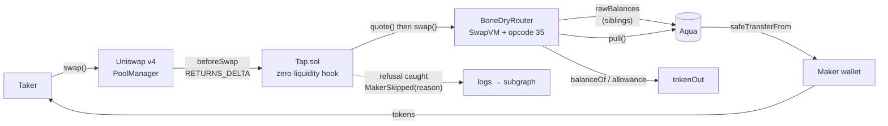
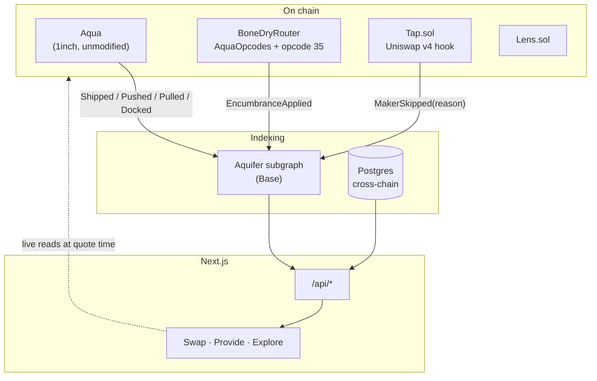

<div align="center">

# Bone Dry

**A promise that can't bounce.**

An Aqua position that prices itself off its own wallet's existing obligations —
and refuses, on-chain, before it can write a cheque that bounces.

[](https://github.com/1inch/aqua)
[](https://github.com/1inch/swap-vm/tree/release/1.0.2)
[](https://github.com/Uniswap/v4-core)
[](https://api.studio.thegraph.com/query/1758723/aquifer/v0.0.3)
[](#security-and-testing)

Built for ETHOnline 2026 — 1inch (Build an Aqua App), Uniswap Foundation, The Graph.

</div>

---

On [1inch Aqua](https://github.com/1inch/aqua), a market maker never deposits
anything. The money stays in their own wallet — they just **promise** it. That is
genuinely new, and it is the entire reason Aqua is interesting.

It also means nothing stops a maker promising the same money twice. Or 257 times.

## Table of contents

- [The problem, in one paragraph](#the-problem-in-one-paragraph)
- [We measured it](#we-measured-it)
- [How it works](#how-it-works)
  - [One fill, end to end](#one-fill-end-to-end)
  - [What a fill costs](#what-a-fill-costs)
- [Architecture](#architecture)
- [The instruction](#the-instruction)
  - [The curve](#the-curve)
  - [Why the sibling list comes from the maker](#why-the-sibling-list-comes-from-the-maker)
- [Three tracks](#three-tracks)
  - [1inch — Build an Aqua App](#1inch--build-an-aqua-app)
  - [Uniswap Foundation](#uniswap-foundation)
  - [The Graph](#the-graph)
- [What is live, and what is not](#what-is-live-and-what-is-not)
- [Tech stack](#tech-stack)
- [Repository structure](#repository-structure)
- [Getting started](#getting-started)
- [Deployed addresses](#deployed-addresses)
- [Security and testing](#security-and-testing)
- [Known limits](#known-limits)

---

## The problem, in one paragraph

`Aqua.ship()` writes a number into a mapping. No transfer, no lock, no check:

```solidity
function ship(address app, bytes calldata strategy, address[] calldata tokens, uint256[] calldata amounts)
    external returns (bytes32 strategyHash)
{
    strategyHash = keccak256(strategy);
    emit Shipped(msg.sender, app, strategyHash, strategy);
    for (uint256 i = 0; i < tokens.length; i++) {
        Balance storage balance = _balances[msg.sender][app][strategyHash][tokens[i]];
        require(balance.tokensCount == 0, StrategiesMustBeImmutable(app, strategyHash));
        balance.store(amounts[i].toUint248(), tokensCount);   // ← a number. that is all.
    }
}
```

A maker with 100 USDC can ship five strategies each promising 100 USDC, and every
one of them is individually valid — each is ≤ 100. They share one balance, so only
the first taker to arrive gets paid. Everyone else's transaction reverts on the
last line, when `safeTransferFrom` finds an empty wallet.

It is writing cheques with nothing checking the balance.

**Everyone else in this field built a better price. We built a promise that can't
bounce.**

## We measured it

Ethereum mainnet, our own index:

| Token | Advertised | Actually deliverable | Phantom |
|---|---:|---:|---:|
| WETH | 102,593 | **4** | 100% |
| USDC | 5,253,030 | 131,572 | 97.5% |
| USDT | 733,111 | 290,988 | 60.3% |
| DAI | 288,313 | 228,976 | 20.6% |

860 maker/token pairs are backed by more than one strategy. **600 of them promise
more than the wallet holds. 419 have zero backing at all.** The largest single
wallet carries **257 strategies on one token**.

Per maker: `committed = Σ virtual across their live strategies`,
`backing = min(wallet balance, allowance)`, `deliverable = min(committed, backing)`.

> **Read this before quoting the numbers.** Some advertised figures are absurd on
> purpose — one strategy promises 1.4 billion WBTC, which exceeds every bitcoin
> that will ever exist. Those are junk commitments, and Aqua accepts them without
> complaint. That is evidence *for* the argument, not a flaw in the measurement,
> but do not read it as real depth. DAI at 20.6% matters too: a metric reading
> 100% everywhere would mean the measurement was broken, not the market.

## How it works

A maker ships a strategy whose program contains **opcode 35**. At fill time, before
any settlement, the instruction reads how much of that wallet is already promised
to the maker's *other* strategies, and prices accordingly:

- lightly encumbered → quote is unchanged
- heavily encumbered → quote **widens**
- past a line the maker chose → it **refuses**

Not a filter we run on your behalf. A property of the position itself, true for any
taker through any app, whether Bone Dry is involved or not.

### One fill, end to end — and where each step runs today



1. The taker swaps against a Uniswap v4 pool that holds **zero liquidity**.
2. `Tap.sol` takes the whole swap in `beforeSwap` via `BEFORE_SWAP_RETURNS_DELTA_FLAG`.
3. It quotes each candidate maker through `BoneDryRouter`.
4. Opcode 35 sums the maker's sibling commitments, reads real backing, and either
   adjusts the quote or reverts.
5. Survivors are filled by `Aqua.pull()`, which moves tokens **straight from the
   maker's wallet** — the hook never takes custody.
6. A maker who refused is caught by the hook and logged with the revert selector.
   This matters: **a reverted transaction emits nothing**, so without the hook
   catching it, refusals would be invisible to any indexer.

> **Where this runs today.** There are two Tap hooks on Base, because `Tap.router` is
> `immutable` (`Tap.sol:42`): `0xeAdD3C76…` is bound to 1inch's canonical router
> (146 third-party strategies, opcode table ending at 34) and `0xaC7bCA41…` to
> `BoneDryRouter` (opcode 35). `Aqua.pull` keys balances on `msg.sender`, so the two
> books can never be filled in one transaction.
>
> The app plans both books, ranks them by the rate a taker actually gets, and builds
> the swap against the hook that can fill the winner. At small sizes the Bone Dry
> book wins and steps 3–4 run through opcode 35; at larger sizes its shallow reserves
> price out and the evidence book wins. No signed fill has yet landed through
> opcode 35.
>
> Step 6's `logs → subgraph` edge is not built: the subgraph's `Tap` data source is
> a template nothing instantiates. Refusal reasons shown in the app are **computed
> off-chain** by the same rules — a prediction of what the chain would do, not read
> back from `MakerSkipped`. See [PLAN-GRAPH.md](PLAN-GRAPH.md).

### What a fill costs

Measured on a Base mainnet fork (`forge test --gas-report`):

| Operation | Gas |
|---|---:|
| End-to-end demo: two fills, one refusal | 1,037,462 |
| Single unencumbered fill (Case 1) | 422,579 |
| Fill with one sibling + haircut (Case 2) | 518,883 |
| `EncumbranceApplied` event | ~3,035 |
| Reading one sibling's `rawBalances` | ~2,600 cold |
| **`dock()` — a maker revoking everything** | **4,452** |

That last row is the important one. See [Known limits](#known-limits).

## Architecture



**The rule the app follows:** anything that decides whether a transaction will
succeed is read live from chain at quote time. Anything historical or aggregate
comes from an index. Mixing those up is how a UI says "solvent" and the
transaction then reverts.

## The instruction

`contracts/src/vm/Encumbrance.sol`, appended to the opcode table at index 35.

**We do not fork 1inch's swap-vm repo.** `AquaOpcodes._opcodes()` is declared
`internal pure virtual`, so `BoneDryOpcodes` subclasses and overrides it, appending
opcode 35 and leaving every upstream index 0–34 exactly where it was. Upstream
stays updatable, previously-encoded programs still run, and the track's
*"redeployments of a modified SwapVM contract is allowed"* is satisfied without a
fork. The router comes to **19,793 bytes**, inside EIP-170's 24,576 with no stock
instruction stripped.

```
encumbered = Σ rawBalances(maker, app, siblingHash_i, tokenOut)   // other promises
backing    = min(balanceOf(maker), allowance(maker, AQUA))        // what's really there
util       = encumbered / backing
free       = backing − encumbered
```

Argument encoding, packed into the program:

```
[0:2]                    uint16   siblingCount
[2 : 2+32n]              bytes32  siblingHashes[siblingCount]
[..+32]                  uint256  declaredTotalEncumbrance
[..+2]                   uint16   maxUtilBps      // refuse at or above this
[..+2]                   uint16   widenBps        // haircut at 100% utilisation
```

Docked siblings are skipped — Aqua marks them with `tokensCount == 0xff`, so a
docked strategy encumbers nothing and the quote widens back automatically.

### The curve

```
quote
  │────────────────╮
  │                 ╰──────╮
  │                         ╰────╮
  │                               ╰──╮
  │                                   ╳  ← refuses at maxUtilBps
  └──────────────────────────────────────── utilisation
  0%                                    100%
```

- **exactIn** → `amountOut` is haircut by `amountOut × widenBps × util / 1e8`
- **exactOut** → `amountIn` is raised by the same proportion, rounded up

Both paths then hit the same hard floor: `amountOut > free` reverts
`EncumbranceInsufficient`. The haircut is what makes this a position with a curve
rather than a binary guard; the floor is what sits underneath it.

### Why the sibling list comes from the maker

Aqua's balance mapping is not enumerable. There is no on-chain way to ask *"what
else has this maker shipped?"* — so the strategy carries the hashes in its program.

A dishonest maker can declare a short list and dodge the constraint. **This is not
a hole we missed; it is the seam the rest of the project exists to close.**

| Layer | Job |
|---|---|
| Opcode 35 | enforces the constraint on-chain, at fill time |
| Aquifer subgraph | the only thing that knows *every* live strategy — computes `siblingListComplete` and `missingSiblings` |
| `Tap.sol` | refuses to route to strategies whose list is short *(designed, not yet built)* |

On-chain enforcement and off-chain completeness are two different jobs, and neither
can do the other's.

## Three tracks

### 1inch — Build an Aqua App

The track asks for *"a custom Aqua app that implements a sophisticated DeFi
position"* and scores SwapVM usage higher.

**The position:** a maker's quote is a function of their own unencumbered balance.
Every other approach in this field prices off *external* state — an oracle,
realised volatility, a pool, an auction. This one looks inward, and as far as we
can find, nothing else on Aqua does.

**SwapVM usage is structural, not decorative.** Remove opcode 35 and there is no
encumbrance read, no curve, and no refusal — just a stock quote. The instruction
lives in the opcode table, not behind the `Extruction` escape hatch.

Two mechanics we relied on, each proven separately in
[`FacilityProof.t.sol`](contracts/test/FacilityProof.t.sol):

- **`Aqua.pull()` settles to an arbitrary recipient.** Maker capital can move
  straight to a third party; the app never takes custody and needs no balance
  sheet. We found no other project using this.
- **`dock()` costs 4,452 gas** and is instant, unilateral and unpenalised.

### Uniswap Foundation

`Tap.sol` is a v4 hook on a pool with **zero liquidity**, deployed on Base mainnet
and Base Sepolia. It takes the entire swap in `beforeSwap` using
`BEFORE_SWAP_RETURNS_DELTA_FLAG`, sources depth from maker wallets through Aqua,
and settles with the PoolManager without ever adding liquidity. TVL is zero before
and after — verifiable on chain.

Its second job is the one that is easy to miss: **it is the only place a refusal
can be recorded.** Opcode 35 refuses by reverting, and a reverted transaction emits
no logs. `Tap.sol` try/catches each maker and emits `MakerSkipped` with the revert
selector, which is what makes the refusal feed possible at all.

Hook address mining (CREATE2 salt search for the flag prefix) is in
[`contracts/script/Deploy.s.sol`](contracts/script/Deploy.s.sol).

### The Graph

**Aquifer** — [`subgraph/`](subgraph/), deployed and synced on Base.

The subgraph is not a display layer here; it computes something no contract can.
`handleShipped` decodes opcode 35's arguments straight out of the `Shipped` program
bytes — walking `[opcode][argsLength][args]` exactly as `runLoop` does — so
`maxUtilBps`, `widenBps` and `declaredSiblings` are indexed without any extra
on-chain registration event.

Then it answers the question the chain cannot:

```graphql
type Strategy @entity(immutable: false) {
  usesEncumbrance:     Boolean!
  maxUtilBps:          Int
  widenBps:            Int
  declaredSiblings:    [Bytes!]!
  siblingListComplete: Boolean!     # ← only an index can compute this
  missingSiblings:     [Bytes!]!
  liveSiblingCount:    Int!
}
```

*"You declared 3 siblings. You have 9 live. This strategy will under-constrain."*
Nothing on-chain can produce that sentence, because the balance mapping is not
enumerable.

Two details worth noting:

- **`backing` and `utilBps` are nullable on purpose.** 419 Ethereum maker/token
  pairs genuinely have zero backing, so `0` is a real and dangerous state. `null`
  means *never measured*. Conflating them would render the worst makers as healthy.
- **Refusals are deduplicated.** `Tap.sol` runs two placement passes, so one
  refusal emits `MakerSkipped` twice. `MakerRefusal` is keyed on
  `txHash ++ maker ++ strategyHash` so retries within a swap collapse to one fact.

A second, independent Graph product is used too: **Subgraph MCP**, for cross-protocol
token discovery on unrecognised addresses in the lookup tab.

## What is live, and what is not

A status table that overclaims is worse than none.

| | State |
|---|---|
| Opcode 35, `Encumbrance.sol` + `BoneDryOpcodes` + `BoneDryRouter` | built, 54 fork tests green |
| Router size 19,793 / 24,576 bytes, nothing stripped | verified by test |
| `Tap.sol` — Uniswap v4 zero-liquidity hook | **deployed**, Base mainnet + Base Sepolia |
| `Aquifer` subgraph on Base | **deployed and synced** |
| Encumbrance entities + sibling completeness | built, 15 matchstick tests green |
| `MakerSkipped` with revert selector | built, tested |
| Postgres index over 1inch's Aqua API (Ethereum) | live, refreshed on a schedule |
| `BoneDryRouter` deployed to a public network | **deployed**, Base mainnet `0x74195573…` |
| Provide-tab encumbrance builder, shipping opcode 35 | **live** — declares encumbrance server-side from `rawBalances` |
| App routing a swap through the opcode-35 hook | **built** — the router plans both books and routes to the hook that can fill; first signed fill pending |
| `MakerRefusal` / `EncumbranceApplication` indexed | **not yet** — see [PLAN-GRAPH.md](PLAN-GRAPH.md) |
| Subgraph on Ethereum mainnet | **not yet** — see Known limits |
| `Tap.sol` gate refusing incomplete sibling lists | **not yet** |

## Tech stack

| Layer | Choice |
|---|---|
| Contracts | Solidity 0.8.30, Foundry, `via_ir`, `evm_version = cancun` |
| Upstream | `1inch/swap-vm@release/1.0.2`, `1inch/aqua`, `Uniswap/v4-core` |
| Index | The Graph (AssemblyScript), Matchstick, Postgres (Neon) |
| App | Next.js 16, React 19, wagmi 3, viem 2, RainbowKit |
| Motion | GSAP + ScrollTrigger, Lenis |
| Jobs | GitHub Actions (Vercel Hobby cron caps at once/day) |

`via_ir`, `solc 0.8.30` and `cancun` are **not optional**: SwapVM dispatches through
internal function pointers, which only resolve under the IR pipeline, and its router
guards reentrancy with transient storage.

## Repository structure

```
contracts/
  src/vm/Encumbrance.sol       opcode 35 — the position
  src/vm/BoneDryOpcodes.sol    opcode table, index 35 appended
  src/vm/BoneDryRouter.sol     the redeployed SwapVM router
  src/Tap.sol                  Uniswap v4 hook, zero-liquidity pool
  src/Lens.sol                 on-chain solvency reads
  src/Wellhead.sol             the router a wallet calls
  src/BeaconStrategy.sol       Chainlink-priced Extruction strategy
  test/                        54 tests, Base mainnet fork
subgraph/
  schema.graphql               Aquifer entities
  src/aqua.ts                  ship/push/pull/dock + opcode 35 decode
  src/swapvm.ts                fills + EncumbranceApplied
  src/tap.ts                   refusals, deduplicated
  tests/                       15 matchstick tests
web/
  app/ui/                      Landing, Desk, tabs
  lib/                         chain reads, index, routing
  hooks/
```

## Getting started

```bash
# contracts — lib/ is not committed
cd contracts
forge install
forge test                              # 54 tests, Base mainnet fork
forge test --match-contract Encumbrance -vv   # opcode 35 only

# subgraph
cd ../subgraph
npm install
graph codegen && graph build
graph test                              # 15 matchstick tests

# app
cd ../web
npm install
cp .env.example .env.local              # RPC URLs, DATABASE_URL, GRAPH_URL
npm run dev
```

A Base RPC is required for the fork tests — set `BASE_RPC_URL`, or they fall back
to the public endpoint and will rate-limit.

## Deployed addresses

### Base Sepolia (84532) — where you can try it

| Contract | Address |
|---|---|
| Aqua | [`0x7a062f824FAbdf2360354Ad52B3752065150Da61`](https://sepolia.basescan.org/address/0x7a062f824FAbdf2360354Ad52B3752065150Da61) |
| SwapVM router (`v1.0.2`) | [`0xD0a0A94711aa39EfcC3Ab2aF63ffa5BAD4E640a7`](https://sepolia.basescan.org/address/0xD0a0A94711aa39EfcC3Ab2aF63ffa5BAD4E640a7) |
| `Tap` (v4 hook) | [`0xD5Bca5F5Df642E7cfDbA692FE8C3851c89238088`](https://sepolia.basescan.org/address/0xD5Bca5F5Df642E7cfDbA692FE8C3851c89238088) |
| `Lens` | [`0xA3ce77230A06302e3De32A3816f46C293c9D291F`](https://sepolia.basescan.org/address/0xA3ce77230A06302e3De32A3816f46C293c9D291F) |
| `Wellhead` | [`0x0A54ac0705Aeab8AB29F48899d2B347D7235a531`](https://sepolia.basescan.org/address/0x0A54ac0705Aeab8AB29F48899d2B347D7235a531) |

Aqua and the SwapVM router here are **our own deployments, built unmodified from
1inch's sources** — 1inch have never deployed Aqua to a testnet. The router is built
from tag `v1.0.2`, whose opcode table matches what `@1inch/swap-vm-sdk` emits;
`main` has renumbered `XYCSwap` and will not run SDK programs.

A recorded fill: 5 USDC sold, 1425979680696660 wei WETH received, split 3:2 across
two solvent makers matching their depths. A third maker promised the same and held
nothing, and was skipped. Pool liquidity after: **0**.

### Base (8453) — the evidence, and our own contracts beside it

Reads run against **1inch's own canonical Aqua**, with 146 third-party maker
strategies we did not ship. Our contracts are deployed on the same chain.

**1inch's, not ours:**

| Contract | Address |
|---|---|
| Aqua | [`0x1111113ccf1426a8e30e2bff5e005d929bf6a90a`](https://basescan.org/address/0x1111113ccf1426a8e30e2bff5e005d929bf6a90a) |
| SwapVM router | [`0x111111338c5091E8440b67B168bAe16a668AC0De`](https://basescan.org/address/0x111111338c5091E8440b67B168bAe16a668AC0De) |

**Ours, deployed to Base mainnet:**

| Contract | Address | Size |
|---|---|---|
| `BoneDryRouter` — SwapVM + opcode 35 | [`0x74195573Fa9bC965667e03319F2C58567d4B96BE`](https://basescan.org/address/0x74195573Fa9bC965667e03319F2C58567d4B96BE) | 19,793 b |
| `Tap` — v4 hook bound to `BoneDryRouter` | [`0xaC7bCA41EA8Fce76651684943Db2c38003c98088`](https://basescan.org/address/0xaC7bCA41EA8Fce76651684943Db2c38003c98088) | 6,158 b |
| `Tap` — v4 hook bound to 1inch's router, **the one the app routes through** | [`0xeAdD3C76bB9f3D8Aa26fA9F793A893e2aBa24088`](https://basescan.org/address/0xeAdD3C76bB9f3D8Aa26fA9F793A893e2aBa24088) | 5,849 b |
| `Lens` | [`0xbC7C42DA3a234cAf8d44cbeB440610CDB8790Fd6`](https://basescan.org/address/0xbC7C42DA3a234cAf8d44cbeB440610CDB8790Fd6) | |
| `Wellhead` | [`0xae0188F3b68804847a740C0F7016e1A4E0bB4E64`](https://basescan.org/address/0xae0188F3b68804847a740C0F7016e1A4E0bB4E64) | |
| Subgraph | [`aquifer/v0.0.3`](https://api.studio.thegraph.com/query/1758723/aquifer/v0.0.3) — predates the encumbrance entities | |

Two v4 pools are initialised, one per hook (`0x620f798e…`, `0x33e4c020…`), both
holding zero liquidity by design.

There are two hooks because `Tap.router` is `immutable` and a v4 pool binds to
exactly one hook. The second was deployed once `BoneDryRouter` existed; the app
has not been moved onto it yet. See the note under [One fill, end to
end](#one-fill-end-to-end--and-where-each-step-runs-today).

**Three live encumbrance strategies**, maker
`0x60b9FcAFCdDeAEd79b5B5486c036Fe03BE8B075f`, repriced to market on 2026-09-12: 0.029558 USDC :
0.0000117 WETH each (2,526 USDC/WETH against a Chainlink read of 2,526), promising 0.0887 USDC and
0.0000351 WETH in total against a wallet holding 0.2276 and 0.0000389 — sibling encumbrance at
6,011 bps, under the 8,000 refusal line with the widening curve already active. The first set,
shipped at an implied 5,833, is left live as a real example of a maker quoting well above market.
`ship()` transfers nothing, so an unbacked position would have cost exactly the
same and been the phantom liquidity this project measures. The ship script carries
`require()` guards that abort rather than overpromise.

### Ethereum (1) — read-only

Same Aqua and router addresses as Base. **No Bone Dry contracts are deployed here**
— this network exists in the app to show the measurement at scale.

## Security and testing

```
forge test        → 54 passed, 0 failed  (12 suites, Base mainnet fork)
graph test        → 15 passed, 0 failed  (matchstick)
```

Everything runs against **real Aqua on a fork**, not mocks.

| Suite | What it establishes |
|---|---|
| [`Encumbrance.t.sol`](contracts/test/Encumbrance.t.sol) | 16 cases: haircut curve, refusal, docked siblings, exactIn/exactOut symmetry, under-declaration caught by spot-check, quote↔swap parity **to the wei**, bytecode under EIP-170 |
| [`EncumbranceFillDemo.t.sol`](contracts/test/EncumbranceFillDemo.t.sol) | one maker, one wallet: a fill succeeds, then siblings encumber the balance and the identical quote refuses |
| [`TapEncumbranceRefusal.t.sol`](contracts/test/TapEncumbranceRefusal.t.sol) | a refusal caught by the hook, logged with `EncumbranceExceeded.selector`, and the swap routed around it |
| [`FacilityProof.t.sol`](contracts/test/FacilityProof.t.sol) | the four Aqua mechanics the design rests on — see [PROOFS.md](PROOFS.md) |
| [`TapFill.t.sol`](contracts/test/TapFill.t.sol), [`NaiveTap.t.sol`](contracts/test/NaiveTap.t.sol) | hook fills, fuzzed 1 USDC to 100M |

**Quote and swap can legitimately disagree.** If a sibling is filled between the
two, the answer moves and the swap reverts. That is the mechanism working, and it
is documented in the instruction rather than hidden.

## Known limits

- **A maker with more than 6 siblings can under-declare.** SwapVM's `runLoop` reads
  instruction args with a `uint8` length, capping one instruction at 255 bytes —
  room for 6 sibling hashes alongside the header and the declared total. The
  subgraph flags any short list via `siblingListComplete`; the `Tap.sol` gate that
  refuses to route to them is designed and **not yet built**.
- **The subgraph indexes Base only.** The Ethereum figures above come from our
  Postgres index over 1inch's Aqua API, not from The Graph. The same manifest
  deployed to Ethereum would close this — Aqua and SwapVM are at identical
  addresses on both chains. The completeness perf work is also untested against its
  worst case, because the 257-strategy maker is on Ethereum and Base only carries
  549 strategies shipped all-time — 163 of them currently active.
- **The app routes through the hook that cannot reach opcode 35.** `Tap.router` is
  `immutable` and a v4 pool binds one hook, so the 146 third-party Aqua strategies
  (shipped to 1inch's router) and our opcode-35 strategies (shipped to
  `BoneDryRouter`) are two books that no single transaction can fill from —
  `Aqua.pull` keys balances on `msg.sender`. The app currently routes the first.
  Closing this is a routing change, not a contract change: both hooks and both
  pools are already live. [PLAN-TWO-BOOKS.md](PLAN-TWO-BOOKS.md).
- **Refusals are predicted, not yet read back.** `Tap.sol` catches each maker's
  revert and emits `MakerSkipped` with the selector, which is the only way a
  refusal can be observed at all. Nothing consumes it yet: the subgraph's `Tap`
  data source is a template nothing instantiates. Every refusal reason in the app
  is computed off-chain from the same rules — a faithful prediction, and clearly a
  different kind of evidence. [PLAN-GRAPH.md](PLAN-GRAPH.md).
- **Nothing on Aqua is binding.** `dock()` costs 4,452 gas, is instant and
  unilateral. No commitment can be relied upon, and nothing in this repo claims
  otherwise.
- **Sepolia's `Tap`** predates a dust-fold fix present on the Base mainnet
  deployment.

## Documents

| | |
|---|---|
| [PROOFS.md](PROOFS.md) | four Aqua mechanics, proven on a mainnet fork |
| [COUNCIL-VERDICT.md](COUNCIL-VERDICT.md) | the measurement, and why the direction changed |
| [COMPETITIVE-PLAN.md](COMPETITIVE-PLAN.md) | what 23 other Aqua projects actually ship |
| [PLAN-ANTIGRAVITY-VM.md](PLAN-ANTIGRAVITY-VM.md) | the opcode build spec |
| [PLAN-ANTIGRAVITY-EVENTS.md](PLAN-ANTIGRAVITY-EVENTS.md) | events and indexing spec |
| [PLAN-ANTIGRAVITY-UI.md](PLAN-ANTIGRAVITY-UI.md) | landing, dashboard and tabs spec |
